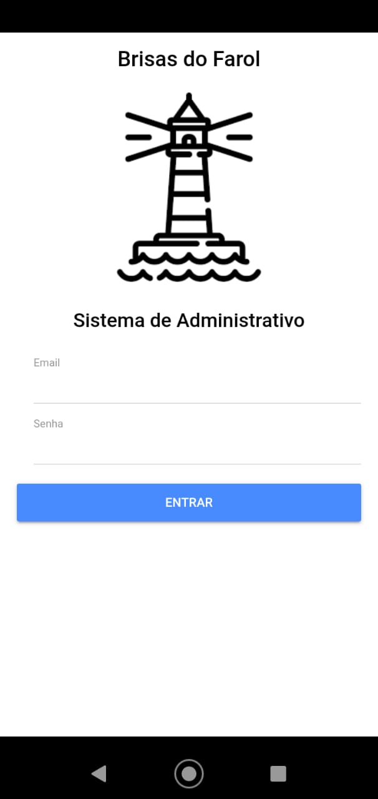
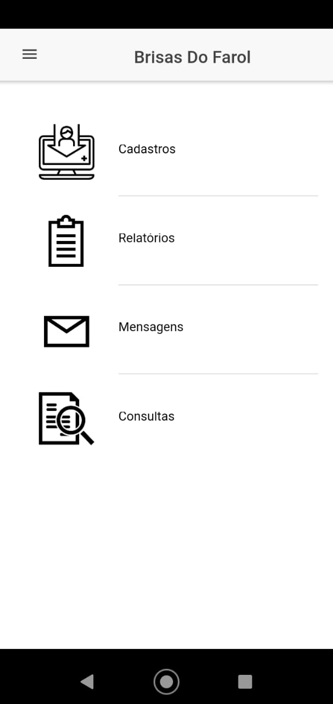
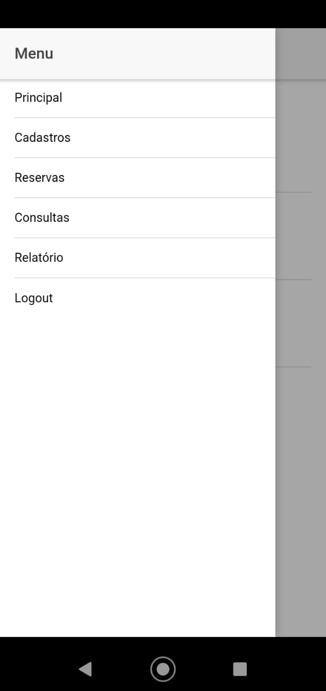
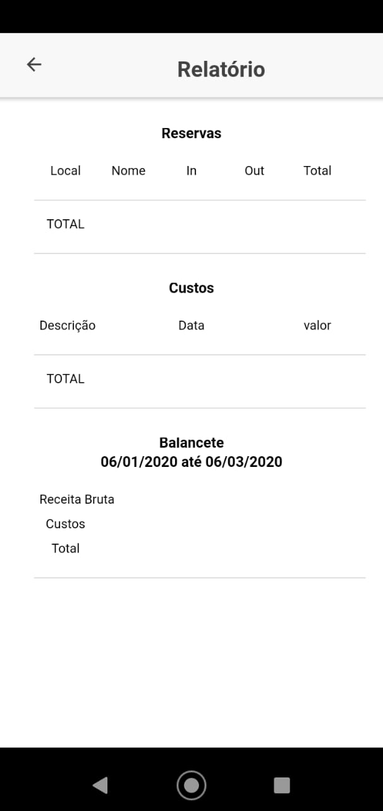

# Gerenciador_Hospedagem_FrontEnd

Este repositório é destinado a um projeto feito por mim para administrar as hospedagens de um determinado estabelecimento.
Neste projeto é possível o cadastro, edição e exclusão (desde que não exista vínculo nenhum com outro domínio) de hospedagens, clientes e reservas.
Nossa tela principal possui a seguinte aparência.

  
  <h4>Tela LogIn</h4>

Nesta página ingressamos com o login e senha para acessar outros recursos disponíveis no sistema. Após feito o login vamos diretamente para a página do menu principal onde nela é possível consultar, cadastrar e editar os recursos do sistema.

  
  <h4>Página Principal</h4>

Agora que estamos no sistema podemos acessar outros outras opções como consultar as hospedagens, reservas e demais.
Segue abaixo algumas das outras paginas disponíveis no sistema.

  
  
  <h4>SideMenu</h4>
  
  <h4>Relatório</h4>

